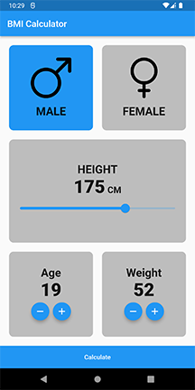
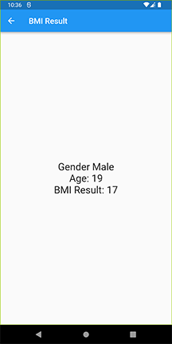

# BMI Calculator

Looks simple application? It is! As the target was getting from managing the state with SetState and StatefulWidgets to handle the state using Cubit.

#### This app is taking four inputs from the user:
- Gender
- Height
- Age
- Weight

Image 1: Main Screen

#### The result is obtained using the following formula:
- Weight / (Height / 100) ^ 2

After pressing calculate you will be taken to a page displaying your BMI result, as shown in next image

Image 2: Result Screen
